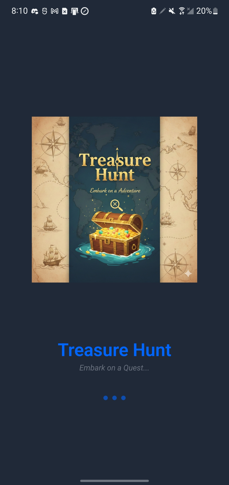
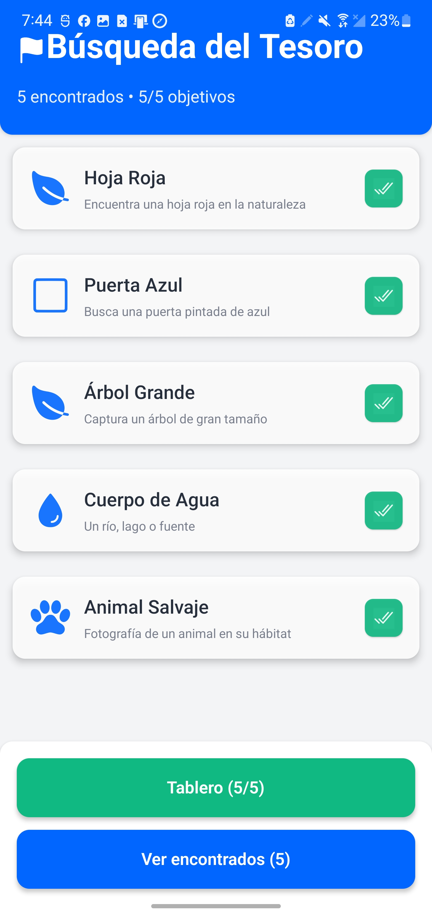
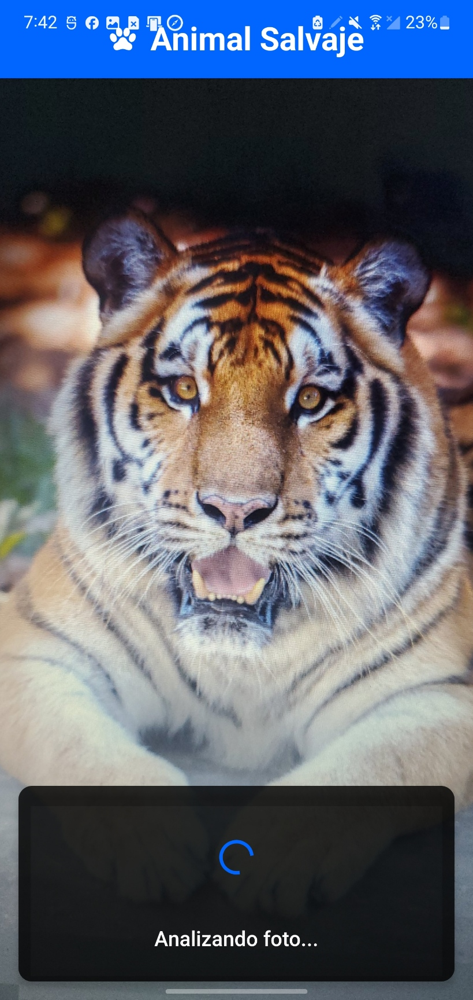
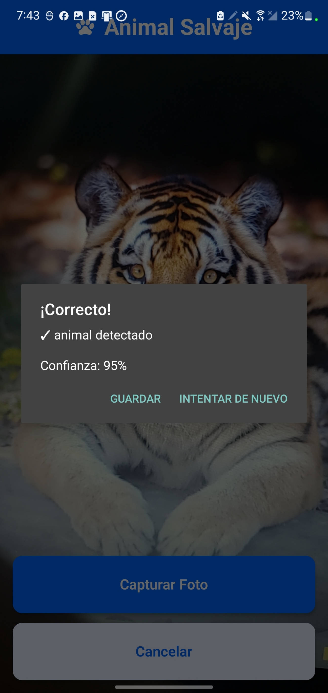
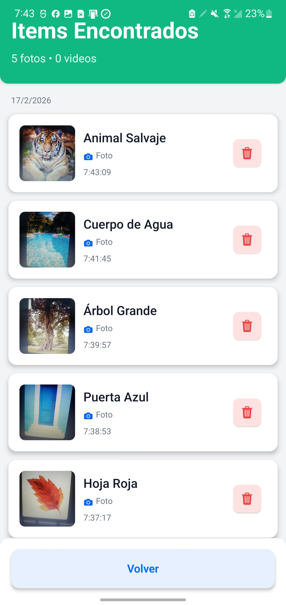
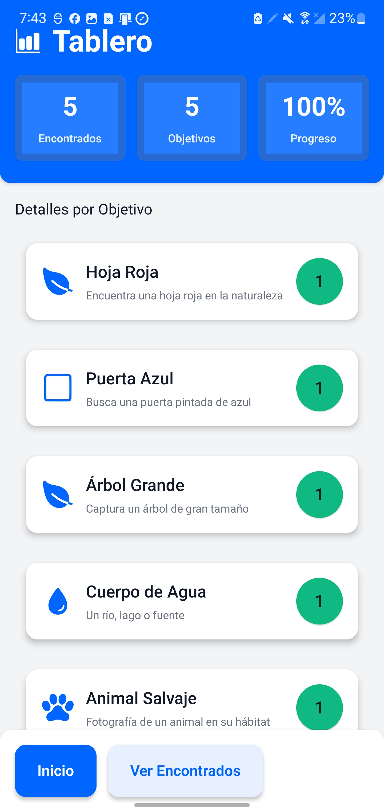

# Treasure Hunt App

Interactive mobile scavenger hunt app where users capture photos and videos to find real-world objects. Uses AI-powered object detection with Google Gemini Vision API.

## Installation & Setup

Clone and run the project:

```bash
git clone https://github.com/JoseFM20/TreasureHuntApp0.1.git
cd TreasureHuntApp0.1
npm install
npm start
```

Then scan the QR code with **Expo Go** app on your phone, or press:
- `a` for Android emulator
- `i` for iOS simulator

## How to Use

1. Select a treasure target (leaf, door, tree, water, or animal)
2. Take a photo or record a video (max 10 seconds)
3. AI detects if it matches the target
4. Found items appear in the Found List
5. Track your progress on the Scoreboard

## Features

- Photo and video capture
- AI object detection (Gemini Vision API)
- Local data persistence
- Real-time validation
- Progress tracking with statistics

## Tech Stack

React Native, Expo, TypeScript, Google Gemini Vision API, AsyncStorage

## Screenshots

| Loading Screen | Home Screen | Analyse Screen |
|---|---|---|
|  |  |  |
| App startup | Shows 5 treasure targets | Photo/video capture & AI analysis |

| Analyse Message | Found List | Scoreboard |
|---|---|---|
|  |  |  |
| AI detection result | Found items history | Progress & statistics |

